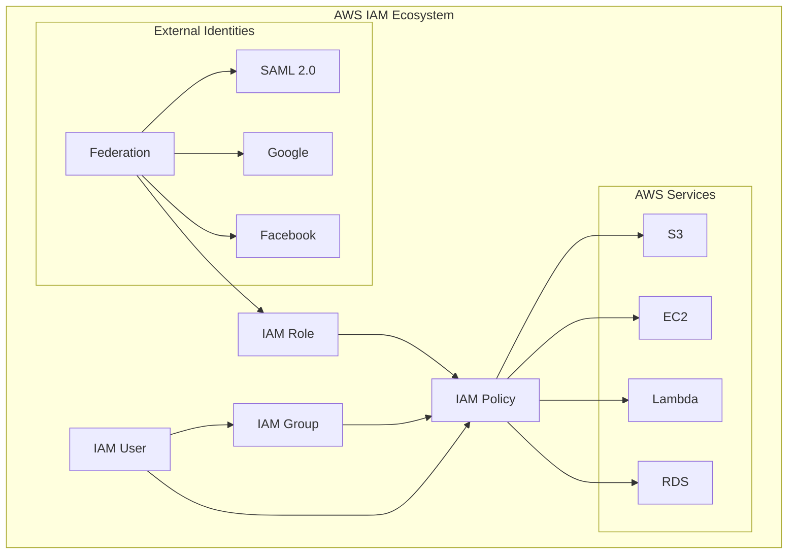

# AWS IAM (Identity and Access Management) Comprehensive Tutorial

## Table of Contents
1. [Introduction to AWS IAM](#introduction)
2. [Core IAM Concepts](#core-concepts)
3. [IAM Users and Groups](#users-groups)
4. [IAM Policies](#policies)
5. [IAM Roles](#roles)
6. [Identity Federation](#federation)
7. [Security Features](#security)
8. [Best Practices](#best-practices)
9. [Practical Examples](#examples)
10. [Troubleshooting](#troubleshooting)

<a name="introduction"></a>
## 1. Introduction to AWS IAM

AWS Identity and Access Management (IAM) enables you to manage access to AWS services and resources securely. IAM provides centralized control of your AWS account.

**Key Features:**
- **Fine-grained access control**
- **Multi-factor authentication (MFA)**
- **Identity federation**
- **Temporary credentials**
- **Access analyzer**

<a name="core-concepts"></a>
## 2. Core IAM Concepts

### IAM Architecture Overview



### IAM Components Relationship


<a name="users-groups"></a>
## 3. IAM Users and Groups

### IAM Users Structure


### User Creation Process


<a name="policies"></a>
## 4. IAM Policies

### Policy Structure and Types


### Policy Evaluation Logic


<a name="roles"></a>
## 5. IAM Roles

### IAM Roles Overview


### Role Assumption Process


<a name="federation"></a>
## 6. Identity Federation

### Federation Architecture


### SAML Federation Flow


<a name="security"></a>
## 7. Security Features

### IAM Security Framework


<a name="best-practices"></a>
## 8. Best Practices

### IAM Best Practices Framework


### Permission Strategy


<a name="examples"></a>
## 9. Practical Examples

### AWS CLI Examples

```bash
# Create IAM user
aws iam create-user --user-name john-doe

# Create IAM group
aws iam create-group --group-name Developers

# Add user to group
aws iam add-user-to-group --user-name john-doe --group-name Developers

# Create policy
aws iam create-policy --policy-name S3ReadOnly --policy-document file://s3-readonly.json

# Attach policy to group
aws iam attach-group-policy --group-name Developers --policy-arn arn:aws:iam::aws:policy/AmazonS3ReadOnlyAccess

# Create role
aws iam create-role --role-name EC2-S3-Access --assume-role-policy-document file://ec2-trust-policy.json

# Attach policy to role
aws iam attach-role-policy --role-name EC2-S3-Access --policy-arn arn:aws:iam::aws:policy/AmazonS3ReadOnlyAccess
```

### Policy Documents Examples

**s3-readonly.json:**
```json
{
    "Version": "2012-10-17",
    "Statement": [
        {
            "Effect": "Allow",
            "Action": [
                "s3:GetObject",
                "s3:ListBucket"
            ],
            "Resource": [
                "arn:aws:s3:::example-bucket",
                "arn:aws:s3:::example-bucket/*"
            ]
        }
    ]
}
```

**ec2-trust-policy.json:**
```json
{
    "Version": "2012-10-17",
    "Statement": [
        {
            "Effect": "Allow",
            "Principal": {
                "Service": "ec2.amazonaws.com"
            },
            "Action": "sts:AssumeRole"
        }
    ]
}
```

### Python Boto3 Examples

```python
import boto3
import json

def create_iam_user(username):
    """Create IAM user with basic permissions"""
    iam = boto3.client('iam')
    
    try:
        # Create user
        response = iam.create_user(UserName=username)
        print(f"Created user: {username}")
        
        # Create login profile
        iam.create_login_profile(
            UserName=username,
            Password='TempPassword123!',
            PasswordResetRequired=True
        )
        print("Login profile created")
        
        return response['User']['Arn']
        
    except Exception as e:
        print(f"Error creating user: {e}")
        return None

def create_iam_role(role_name, trust_policy, policy_arn):
    """Create IAM role and attach policy"""
    iam = boto3.client('iam')
    
    try:
        # Create role
        role_response = iam.create_role(
            RoleName=role_name,
            AssumeRolePolicyDocument=json.dumps(trust_policy),
            Description=f"Role for {role_name}"
        )
        
        # Attach policy
        iam.attach_role_policy(
            RoleName=role_name,
            PolicyArn=policy_arn
        )
        
        print(f"Created role: {role_name}")
        return role_response['Role']['Arn']
        
    except Exception as e:
        print(f"Error creating role: {e}")
        return None

def list_users_with_mfa():
    """List all IAM users with MFA status"""
    iam = boto3.client('iam')
    
    users = iam.list_users()
    mfa_users = []
    
    for user in users['Users']:
        mfa_devices = iam.list_mfa_devices(UserName=user['UserName'])
        
        user_info = {
            'UserName': user['UserName'],
            'MFAEnabled': len(mfa_devices['MFADevices']) > 0,
            'CreateDate': user['CreateDate']
        }
        
        mfa_users.append(user_info)
    
    return mfa_users

# Example usage
if __name__ == "__main__":
    # Create a user
    user_arn = create_iam_user('test-user')
    
    # Create a trust policy for EC2
    ec2_trust_policy = {
        "Version": "2012-10-17",
        "Statement": [
            {
                "Effect": "Allow",
                "Principal": {"Service": "ec2.amazonaws.com"},
                "Action": "sts:AssumeRole"
            }
        ]
    }
    
    # Create role
    role_arn = create_iam_role(
        'EC2-S3-ReadOnly',
        ec2_trust_policy,
        'arn:aws:iam::aws:policy/AmazonS3ReadOnlyAccess'
    )
    
    # List users with MFA
    users = list_users_with_mfa()
    for user in users:
        print(f"User: {user['UserName']}, MFA: {user['MFAEnabled']}")
```

### Terraform Examples

```hcl
# IAM User with MFA requirement
resource "aws_iam_user" "developer" {
  name = "developer"
  force_destroy = true
}

resource "aws_iam_user_login_profile" "developer" {
  user    = aws_iam_user.developer.name
  pgp_key = "keybase:username"
}

resource "aws_iam_user_policy" "developer_s3" {
  name = "S3Access"
  user = aws_iam_user.developer.name

  policy = jsonencode({
    Version = "2012-10-17"
    Statement = [
      {
        Action = [
          "s3:GetObject",
          "s3:ListBucket"
        ]
        Effect   = "Allow"
        Resource = [
          "arn:aws:s3:::example-bucket",
          "arn:aws:s3:::example-bucket/*"
        ]
      }
    ]
  })
}

# IAM Role for EC2
resource "aws_iam_role" "ec2_s3_access" {
  name = "EC2S3AccessRole"

  assume_role_policy = jsonencode({
    Version = "2012-10-17"
    Statement = [
      {
        Action = "sts:AssumeRole"
        Effect = "Allow"
        Principal = {
          Service = "ec2.amazonaws.com"
        }
      }
    ]
  })
}

resource "aws_iam_role_policy_attachment" "s3_readonly" {
  role       = aws_iam_role.ec2_s3_access.name
  policy_arn = "arn:aws:iam::aws:policy/AmazonS3ReadOnlyAccess"
}

resource "aws_iam_instance_profile" "ec2_profile" {
  name = "EC2S3AccessProfile"
  role = aws_iam_role.ec2_s3_access.name
}
```

<a name="troubleshooting"></a>
## 10. Troubleshooting

### IAM Troubleshooting Guide


### Common IAM Issues and Solutions

1. **Access Denied Errors**
   - Check policy attachments
   - Verify trust relationships
   - Review service control policies (SCPs)

2. **Permission Boundary Issues**
   - Check permission boundaries on users/roles
   - Verify boundary policies allow the required actions

3. **STS AssumeRole Failures**
   - Validate trust policy
   - Check external ID requirements
   - Verify MFA requirements

4. **Federation Issues**
   - Check SAML provider configuration
   - Validate role mappings
   - Review identity provider settings

### Debugging Tools

```bash
# Simulate policies
aws iam simulate-principal-policy \
    --policy-source-arn arn:aws:iam::123456789012:user/john-doe \
    --action-names s3:GetObject

# Get credential report
aws iam generate-credential-report
aws iam get-credential-report

# List access keys
aws iam list-access-keys --user-name john-doe

# Check effective policies
aws iam list-attached-user-policies --user-name john-doe
aws iam list-attached-group-policies --group-name Developers
aws iam list-attached-role-policies --role-name EC2-S3-Access
```

This comprehensive IAM tutorial covers all major concepts with visual diagrams and practical examples. Always follow the principle of least privilege and regularly audit your IAM configurations for security best practices.
