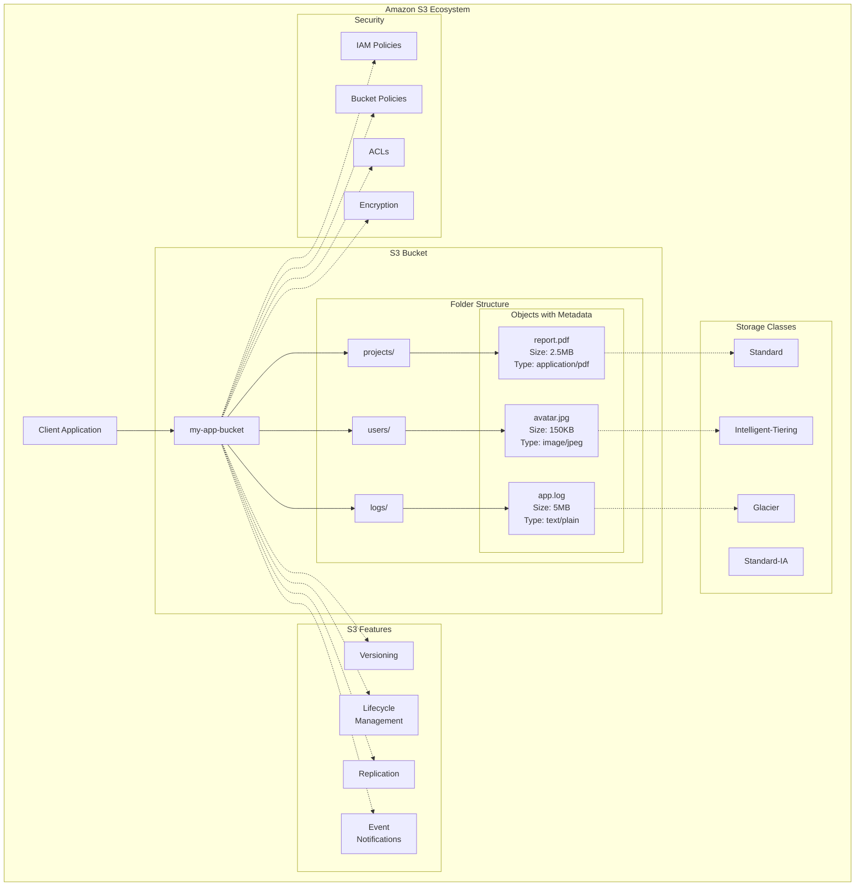
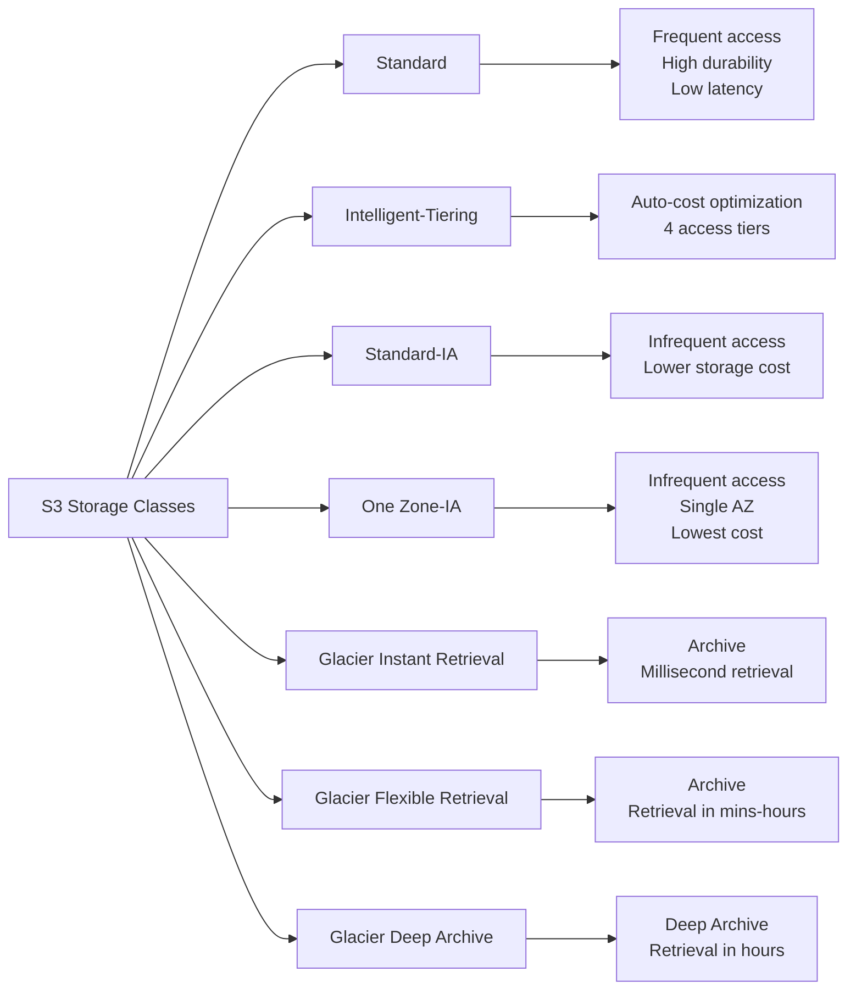
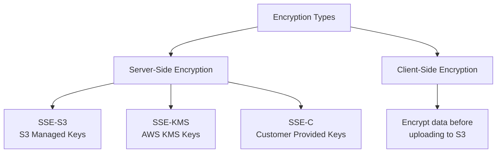
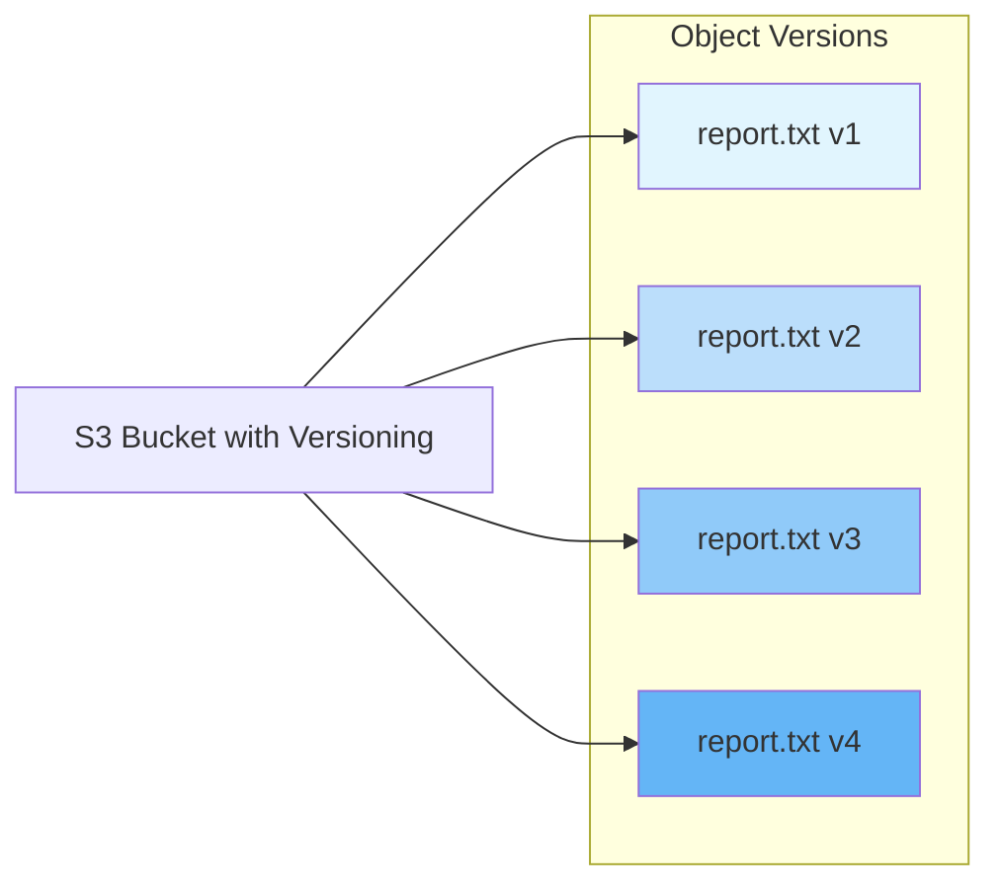
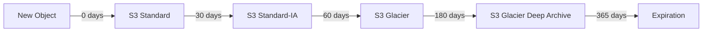
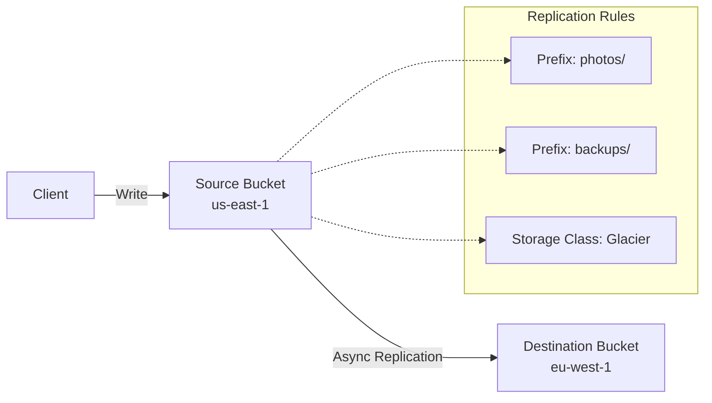
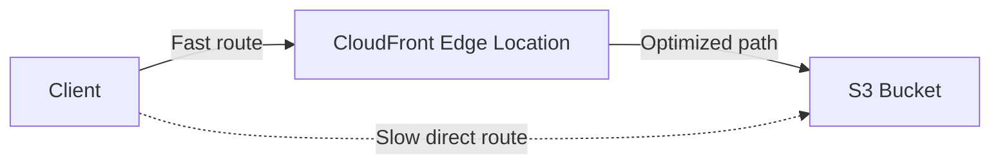
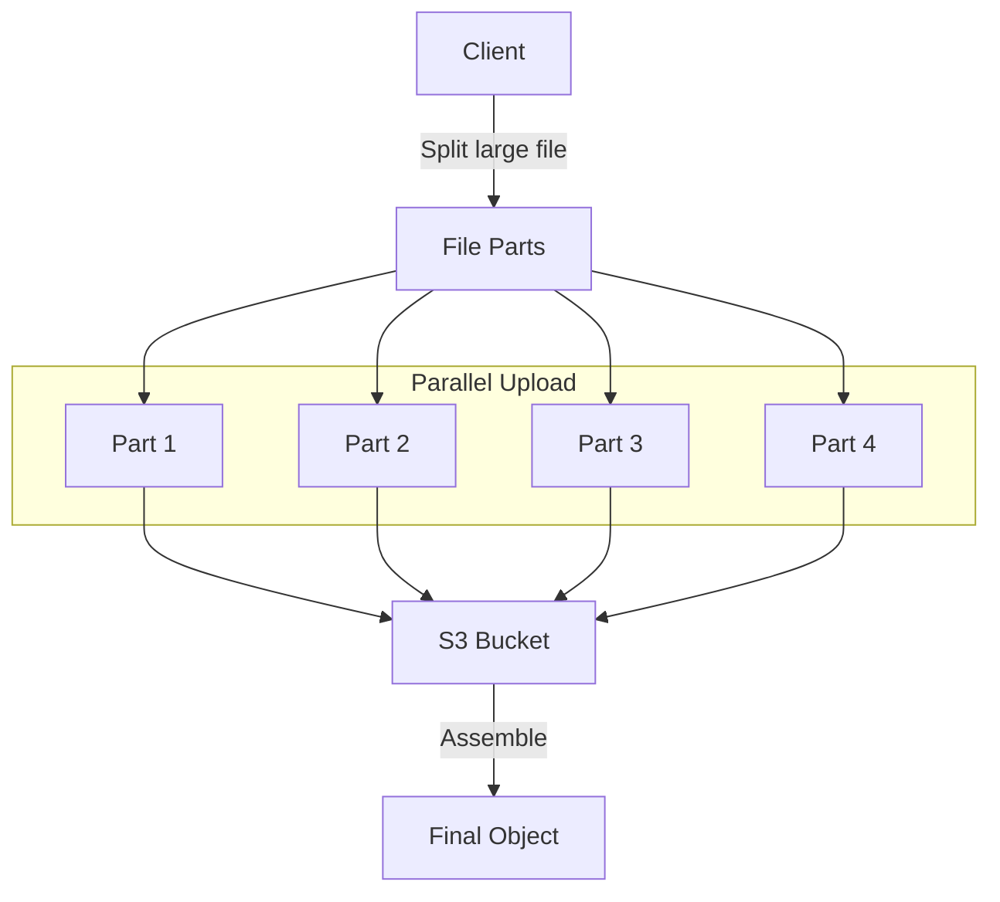
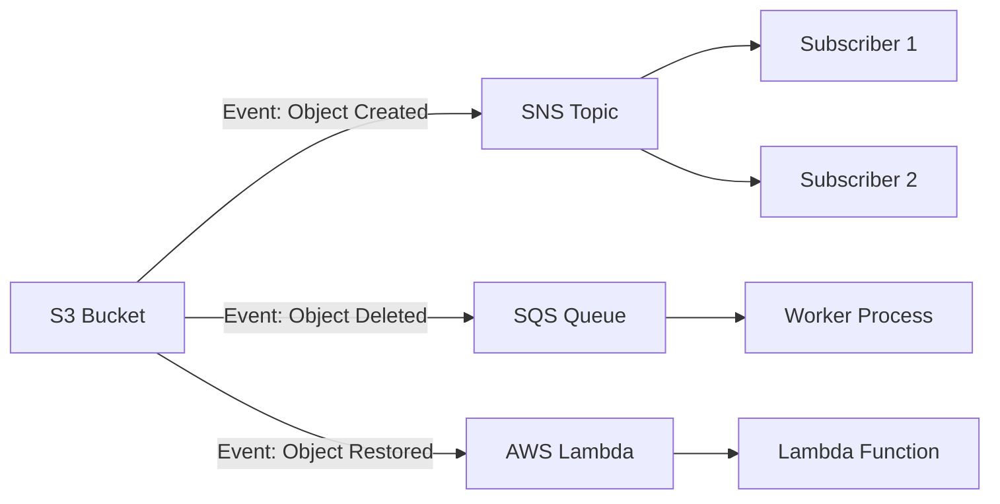

# Amazon S3 (Simple Storage Service) Comprehensive Tutorial

## Table of Contents
1. [Introduction to Amazon S3](#introduction)
2. [Key Concepts](#key-concepts)
3. [Storage Classes](#storage-classes)
4. [Security & Access Control](#security)
5. [Versioning & Lifecycle Management](#versioning)
6. [Replication](#replication)
7. [Performance Optimization](#performance)
8. [Event Notifications](#events)
9. [Practical Examples](#examples)
10. [Best Practices](#best-practices)

<a name="introduction"></a>
## 1. Introduction to Amazon S3

Amazon S3 is an object storage service that offers industry-leading scalability, data availability, security, and performance.

**Key Characteristics:**
- **Object-based storage** (not block storage)
- **Unlimited storage capacity**
- **99.999999999% (11 9's) durability**
- **99.99% availability**
- **Global service** (with regional buckets)

<a name="key-concepts"></a>
## 2. Key Concepts

### Buckets
Containers for storing objects. Bucket names must be globally unique.

```bash
# Example bucket naming
my-app-data-2023
company-name-logs
project-backup-001
```

### Objects
Fundamental entities stored in S3. Consist of:
- **Key** (object name)
- **Value** (data)
- **Version ID** (if versioning enabled)
- **Metadata**
- **Access Control Information**

### Keys
Unique identifier for an object within a bucket.

```
# Example key structure
projects/2023/q1/report.pdf
users/avatar/john_doe.jpg
logs/app/2023-10-15.log
```

## S3 Architecture Diagram



<a name="storage-classes"></a>
## 3. Storage Classes



### Storage Class Comparison Table

| Storage Class | Durability | Availability | Minimum Storage Duration | Use Cases |
|---------------|------------|--------------|--------------------------|-----------|
| Standard | 99.999999999% | 99.99% | None | Frequently accessed data |
| Intelligent-Tiering | 99.999999999% | 99.9% | None | Unknown access patterns |
| Standard-IA | 99.999999999% | 99.9% | 30 days | Infrequently accessed data |
| One Zone-IA | 99.999999999% | 99.5% | 30 days | Reproducible data |
| Glacier Instant Retrieval | 99.999999999% | 99.9% | 90 days | Archive, immediate access |
| Glacier Flexible Retrieval | 99.999999999% | 99.99% (after restore) | 90 days | Archive, backup |
| Glacier Deep Archive | 99.999999999% | 99.99% (after restore) | 180 days | Long-term archive |

<a name="security"></a>
## 4. Security & Access Control

### Encryption Types


### Access Control Methods
- **IAM Policies**: User/role-based permissions
- **Bucket Policies**: Bucket-level permissions
- **ACLs**: Legacy object-level permissions
- **Presigned URLs**: Temporary access to objects

<a name="versioning"></a>
## 5. Versioning & Lifecycle Management

### Versioning Diagram


### Lifecycle Management


<a name="replication"></a>
## 6. Replication

### Cross-Region Replication (CRR)


<a name="performance"></a>
## 7. Performance Optimization

### S3 Transfer Acceleration


### Multipart Upload


<a name="events"></a>
## 8. Event Notifications



<a name="examples"></a>
## 9. Practical Examples

### AWS CLI Examples

```bash
# Create a bucket
aws s3 mb s3://my-unique-bucket-name-123

# Upload a file
aws s3 cp local-file.txt s3://my-bucket/path/to/file.txt

# Sync a directory
aws s3 sync ./local-folder s3://my-bucket/remote-folder/

# Set storage class during upload
aws s3 cp file.txt s3://my-bucket/ --storage-class STANDARD_IA

# Enable versioning
aws s3api put-bucket-versioning --bucket my-bucket --versioning-configuration Status=Enabled

# Set lifecycle policy
aws s3api put-bucket-lifecycle-configuration --bucket my-bucket --lifecycle-configuration file://lifecycle.json
```

### Lifecycle Policy Example (lifecycle.json)
```json
{
  "Rules": [
    {
      "ID": "Move to Glacier after 60 days",
      "Status": "Enabled",
      "Filter": {
        "Prefix": "archive/"
      },
      "Transitions": [
        {
          "Days": 60,
          "StorageClass": "GLACIER"
        }
      ]
    },
    {
      "ID": "Delete old versions",
      "Status": "Enabled",
      "Filter": {
        "Prefix": ""
      },
      "NoncurrentVersionTransitions": [
        {
          "NoncurrentDays": 30,
          "StorageClass": "GLACIER"
        }
      ],
      "NoncurrentVersionExpiration": {
        "NoncurrentDays": 365
      }
    }
  ]
}
```

### Python Boto3 Examples

```python
import boto3
from botocore.exceptions import NoCredentialsError

# Initialize S3 client
s3 = boto3.client('s3')

def upload_file(bucket_name, file_path, object_name=None):
    """Upload a file to S3 bucket"""
    if object_name is None:
        object_name = file_path
    
    try:
        s3.upload_file(file_path, bucket_name, object_name)
        print(f"File {file_path} uploaded to {bucket_name}/{object_name}")
        return True
    except NoCredentialsError:
        print("Credentials not available")
        return False

def generate_presigned_url(bucket_name, object_name, expiration=3600):
    """Generate a presigned URL for temporary access"""
    try:
        url = s3.generate_presigned_url('get_object',
                                       Params={'Bucket': bucket_name,
                                               'Key': object_name},
                                       ExpiresIn=expiration)
        return url
    except Exception as e:
        print(f"Error generating presigned URL: {e}")
        return None

def enable_bucket_versioning(bucket_name):
    """Enable versioning for a bucket"""
    try:
        s3.put_bucket_versioning(
            Bucket=bucket_name,
            VersioningConfiguration={'Status': 'Enabled'}
        )
        print(f"Versioning enabled for {bucket_name}")
    except Exception as e:
        print(f"Error enabling versioning: {e}")

# Example usage
upload_file('my-bucket', 'important-document.pdf', 'documents/important.pdf')
url = generate_presigned_url('my-bucket', 'documents/important.pdf', 3600)
print(f"Presigned URL: {url}")
```

<a name="best-practices"></a>
## 10. Best Practices

### Naming Conventions
- Use descriptive, consistent naming
- Implement folder-like structure with prefixes
- Avoid special characters in object names

### Security Best Practices
- Enable bucket versioning for critical data
- Use IAM roles instead of access keys when possible
- Enable server-side encryption
- Use bucket policies for access control
- Regularly audit access logs

### Performance Optimization
- Use multipart upload for large files (>100MB)
- Use appropriate storage classes
- Enable transfer acceleration for distant users
- Use CloudFront for frequently accessed content

### Cost Optimization
- Implement lifecycle policies
- Use S3 Intelligent-Tiering for unknown patterns
- Clean up incomplete multipart uploads
- Monitor storage usage and access patterns

## Monitoring and Management

```bash
# Monitor storage usage
aws s3api list-buckets
aws s3api get-bucket-metrics-configuration --bucket my-bucket

# Check access patterns
aws cloudwatch get-metric-statistics --namespace AWS/S3 \
  --metric-name BucketSizeBytes --dimensions Name=BucketName,Value=my-bucket

# Analyze storage class distribution
aws s3api list-objects --bucket my-bucket --query "Contents[].StorageClass"
```

This comprehensive tutorial covers all major S3 concepts with visual diagrams and practical examples. Remember to always follow security best practices and monitor your S3 usage for cost optimization.
